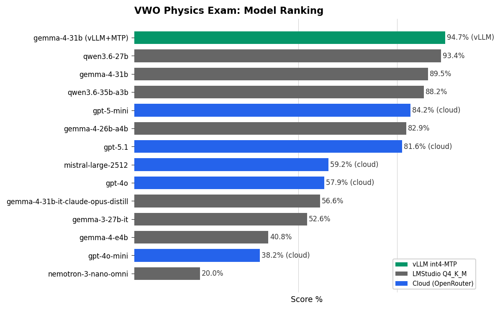
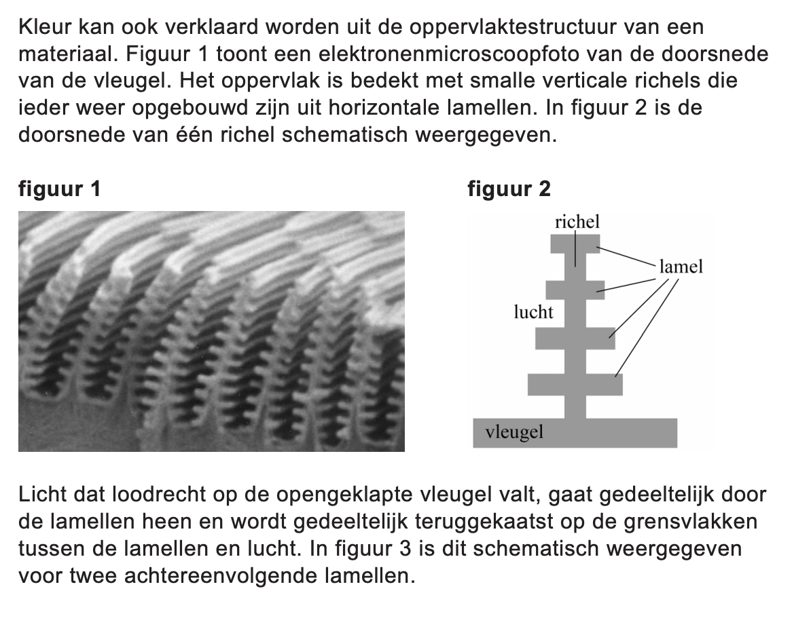
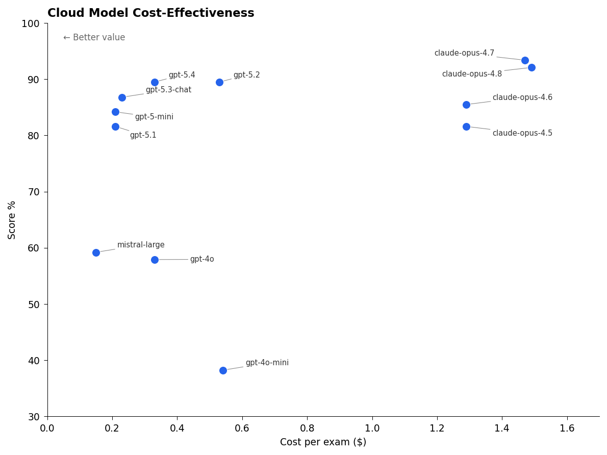
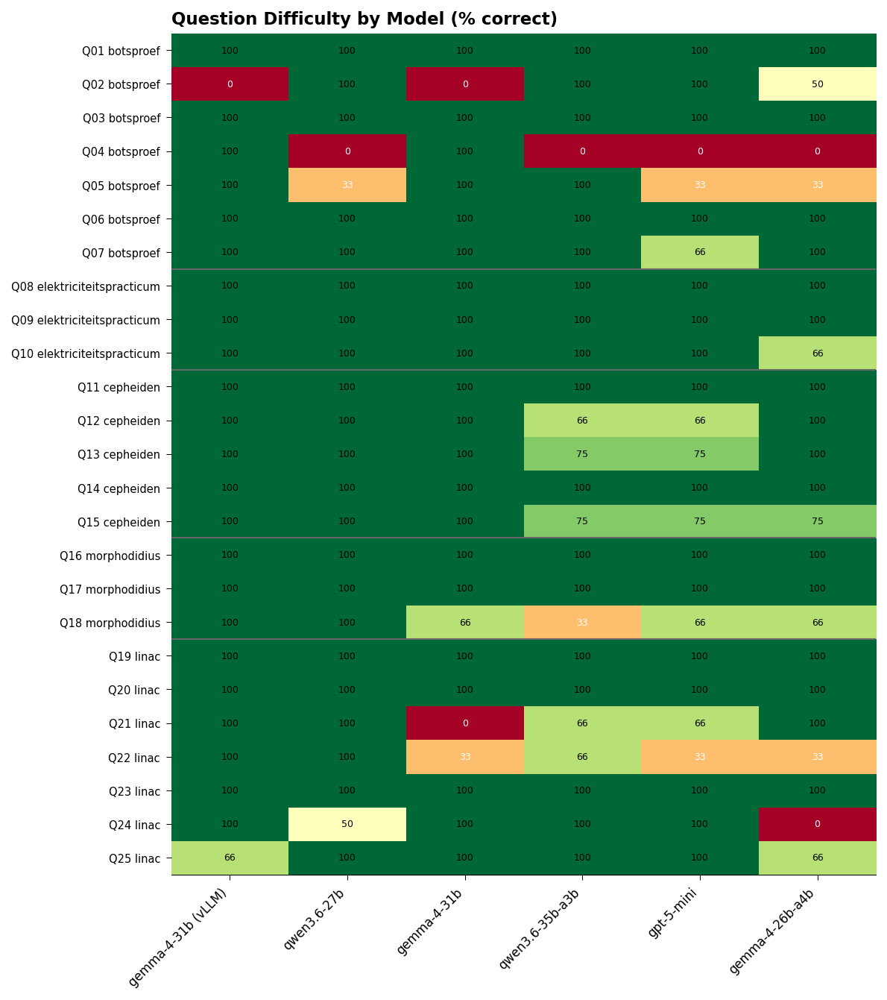
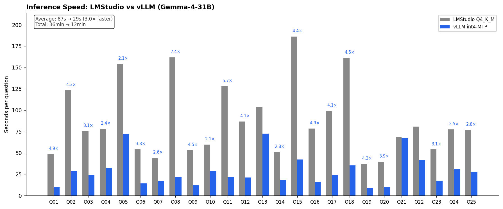

# VWO Natuurkunde Examen 2026 - LLM Benchmark

**Lokale modellen op consumentenhardware overtreffen GPT-4o - twee jaar geleden nog state-of-the-art.**



## Waarom Deze Benchmark?

### Zero Data Contamination

Dit is het VWO natuurkunde examen van **mei 2026**. Geen enkel model kan hierop getraind zijn - de data bestond simpelweg nog niet tijdens training. Dit maakt het een van de weinige benchmarks waar we zeker weten dat we *generalisatie* meten, niet *memorisatie*.

### Historisch Perspectief

- **Maart 2023**: GPT-4 release - text-only, 4K context, sloeg in als een bom
- **Mei 2024**: GPT-4o release - multimodal, 128K context, tool calling
- **Mei 2026**: Lokale ~30B modellen op consumer hardware scoren **>93%**, terwijl GPT-4o blijft steken op **57.9%**

In twee jaar tijd is wat ooit cloud-only frontier capability was, nu beschikbaar op consumentenhardware - en het presteert *beter*. De vooruitgang is eigenlijk ongelooflijk.

### Wat Meet Deze Benchmark?

| Capability | Hoe Getest |
|------------|------------|
| **Vision + Text → Text** | Alle vragen staan in afbeeldingen, niet als tekst |
| **Multi-image reasoning** | Tot 14 afbeeldingen per topic in context |
| **Instructie-opvolging uit images** | Model moet opdrachten in plaatjes lezen en uitvoeren |
| **Nederlands** | Vraag en antwoord volledig in het Nederlands |
| **Lange context coherentie** | Vragen bouwen voort op eerdere antwoorden binnen topic |
| **Domeinkennis (natuurkunde)** | Formules, concepten, natuurkundige constanten (geen Binas meegeleverd) |
| **Wetenschappelijke diagrammen** | Grafieken, schakelschema's, vectordiagrammen |
| **Nauwkeurigheid** | Eenheden, significante cijfers, foutmarges |

### Mogen We Het Intelligentie Noemen?

De resultaten zijn opmerkelijk. Per vraag krijgt het model **zero-shot** de relevante afbeeldingen en als enige tekstprompt: *"Los dit op"* - geen voorbeelden, geen tools, geen calculator. Bij opeenvolgende vragen binnen een topic (opgave) krijgt het model wel de conversatiehistorie: eerdere vragen, antwoorden, en alle bijbehorende afbeeldingen als context. Een lokaal model behaalt zo 93.4% op een VWO eindexamen. Het:

- Leest complexe natuurkundige vraagstukken uit afbeeldingen
- Past correcte formules toe op nieuwe situaties
- Redeneert over concepten (snelheid vs positie, Lorentzkracht)
- Produceert antwoorden in correct Nederlands
- Volgt de gevraagde methode, niet alleen het eindantwoord

Of dit "intelligentie" is, is filosofisch. Maar het is onmiskenbaar *indrukwekkend* - en praktisch bruikbaar voor educatie.

---

## Het Examen

**VWO Natuurkunde 2026, Tijdvak 1** - 25 vragen verdeeld over 5 opgaven (topics):

| Opgave | Topic | Vragen | Onderwerp |
|--------|-------|--------|-----------|
| 1 | botsproef | 7 | Botsingen, impuls, energie |
| 2 | elektriciteitspracticum | 3 | Schakelschema's, metingen |
| 3 | cepheiden | 5 | Astronomie, lichtsterkte, afstand |
| 4 | morphodidius | 3 | Interferentie, dunne laagjes |
| 5 | linac | 7 | Deeltjesversneller, Lorentzkracht |

### Voorbeeld: Q17 (morphodidius)

Een vraag waar lokale modellen excelleren en cloud modellen falen:

| Model | Score |
|-------|-------|
| qwen/qwen3.6-27b | **5/5** |
| google/gemma-4-31b | **5/5** |
| openai/gpt-5.1 | 3/5 |



*Vraag over lichtinterferentie in de lamelstructuur van een vlindervleugel. Vereist begrip van golflengte in een medium (λ_lamel = λ/n) en dunne-film interferentie.*

**Waarom faalt gpt-5.1?** Het model miste dat licht in de lamel een kortere golflengte heeft dan in lucht - een subtiel maar cruciaal natuurkundig inzicht dat de lokale reasoning models wel correct toepassen.

### Bronmateriaal

- **Opgaven:** [`images/2026-05/vw-1023-a-26-1-o/`](images/2026-05/vw-1023-a-26-1-o/)
- **Correctievoorschrift:** [`images/2026-05/vw-1023-a-26-1-o/cv/`](images/2026-05/vw-1023-a-26-1-o/cv/)

---

## Resultaten

### Overall Ranking

| Rank | Model | Score | Stack | Opmerking |
|------|-------|-------|-------|-----------|
| 🥇 | gemma-4-31b | **~93%**† | vLLM int4-MTP | 3× sneller, zie [analyse](analyse/gemma-4-31b-vllm.md) |
| 🥈 | qwen/qwen3.6-27b | **93.4%** | LMStudio Q4_K_M | Best presterend (LMStudio) |
| 🥉 | google/gemma-4-31b | **89.5%** | LMStudio Q4_K_M | |
| 4 | qwen/qwen3.6-35b-a3b | **88.2%** | LMStudio Q4_K_M | MoE variant |
| 5 | openai/gpt-5-mini | **84.2%** | Cloud | Beste cloud model |
| 6 | google/gemma-4-26b-a4b | **82.9%** | LMStudio Q4_K_M | MoE variant |
| 7 | openai/gpt-5.1 | **81.6%** | Cloud | Snelste (~5s/vraag) |
| 8 | mistralai/mistral-large-2512 | 59.2%* | Cloud | *8-image limit |
| 9 | openai/gpt-4o | **57.9%** | Cloud | Vision failures |
| 10 | openai/gpt-4o-mini | 38.2% | Cloud | Vision failures |
| 11 | nvidia/nemotron-3-nano-omni | 20.0% | LMStudio Q4_K_M | |

*Judge: google/gemma-4-31b (LMStudio) of gemma-4-31b (vLLM)*

†vLLM raw score is 96.1%, gecorrigeerd voor [judge-inconsistentie](analyse/gemma-4-31b-vllm.md#judge-resultaten) ~93%

### Cloud Model Kosten vs Prestatie



**gpt-5-mini** domineert: hoogste score (84.2%) bij laagste prijs ($2/M output tokens).

### Vraag Moeilijkheid



**Opvallend:**
- **Q04** (relatieve beweging): Bijna alle modellen falen - conceptuele verwarring tussen snelheid en positie
- **Q22** (Lorentzkracht): Lastig maar niet onmogelijk - qwen3.6-27b scoort 100%
- **Elektriciteitspracticum** (Q08-Q10): Reasoning models scoren hier 100%

---

## Methodologie

### Data Preparatie (eenmalig)

Handmatige screenshots uit de officiële PDF, zoals een leerling ook zou doen. Daarna hernoemd naar een vaste structuur:

```
images/{jaar}/{examencode}/
├── {nr}_{topic}.png                    # Hoofdvraag
├── {nr}_{topic}_opgave.png             # Vraagtekst (indien apart)
├── {nr}_{topic}_figuur_N.png           # Gerefereerde figuren
├── {nr}_{topic}_uitwerkbijlage.png     # Antwoordblad
└── cv/
    ├── {nr}_{topic}_cv.png             # Correctievoorschrift
    └── {nr}_{topic}_cv_aanvullend.png  # Aanvullend CV
```

Voorbeeld: `01_botsproef.png`, `03_botsproef_figuur_3.png`, `cv/01_botsproef_cv.png`

### Evaluatie Pipeline

```
1. SCAN    images/ → metadata.jsonl     (eenmalig)
2. SYNC    metadata.jsonl → SQLite      (eenmalig)
3. SOLVE   Model genereert antwoorden   (per model)
4. JUDGE   Vergelijk met CV             (per judge)
```

### Judge Verificatie

LMStudio-modellen zijn beoordeeld door **google/gemma-4-31b** (LMStudio), vLLM-modellen door **gemma-4-31b** (vLLM). Steekproeven zijn handmatig geverifieerd tegen de officiële correctievoorschriften (CV).

**Bevinding:** De LMStudio judge vertoonde [self-judgment bias](analyse/gemma-4-31b-vllm.md#q21-linac---tekenvraag-judge-inconsistentie) - gaf zichzelf 0/3 op Q21 maar andere modellen 3/3 voor identieke antwoorden. De vLLM judge was consistenter en strikter volgens CV. Scores zijn waar nodig gecorrigeerd in de ranking.

### Temperature Settings

Alle modellen gebruiken de door de fabrikant aanbevolen temperature:

| Model type | Temperature | Reden |
|------------|-------------|-------|
| Reasoning (Qwen, Gemma-4) | **1.0** | Greedy decoding (temp=0) veroorzaakt oneindige loops |
| OpenAI gpt-5.x | 1.0 | Default |
| OpenAI gpt-4o | 0.2 | Aanbevolen voor analytisch werk |
| Mistral | 0.15 | Aanbevolen |

**Let op:** Dit is contra-intuïtief. Traditioneel advies voor analytisch werk is lage temperature. Maar reasoning models met chain-of-thought (zoals Qwen en Gemma-4) raken in een herhalende loop bij greedy decoding - ze blijven dezelfde analyse herhalen zonder te convergeren. Qwen's officiële documentatie waarschuwt expliciet dat *"greedy decoding is a trap"* voor thinking models.

### Hardware & Quantisatie

Lokale modellen gedraaid via LMStudio op een dual-GPU consumer systeem:

| Component | Specificatie |
|-----------|--------------|
| GPU's | 2× RTX 3090 (24GB elk) |
| Quantisatie | **Q4_K_M** voor alle open weights modellen |
| CUDA | 12.6 |
| LMStudio | 0.4.14 |
| Verbruik | ~500W tijdens inferentie |

**MTP (Multi-Token Prediction)** met LMStudio/llama.cpp werkte niet - verkeerde antwoorden door kapotte chat templates of oneindige reasoning loops. Echter, met vLLM en speculative decoding (`--speculative-config gemma-4-31B-it-assistant, n=4`) werkt MTP wél correct voor Gemma-4.

### Optimalisatie: vLLM + Intel int4-AutoRound + MTP

Met vLLM en Multi-Token Prediction (MTP) is Gemma-4-31B **3× sneller** bij gelijke kwaliteit:

| Setup | Score | Tijd/vraag | Tokens/s | Totaal | Kosten |
|-------|-------|------------|----------|--------|--------|
| LMStudio Q4_K_M | ~93%* | 87s | ~15 | 36 min | ~€0.21 |
| **vLLM int4-MTP** | ~93%* | **29s** | **~57** | **12 min** | **~€0.07** |

*Gecorrigeerd voor judge-inconsistentie (zie [analyse](analyse/gemma-4-31b-vllm.md))



**Per-vraag speedup varieert van 2× tot 7×:**
- Korte antwoorden (Q08): 7.4× sneller - MTP acceptance rate hoog
- Lange reasoning (Q21): 1.0× - geen speedup bij complexe chains

**vLLM + MTP configuratie:** [`scripts/run-gemma4-vllm.sh`](scripts/run-gemma4-vllm.sh) — gebaseerd op [club-3090](https://github.com/noonghunna/club-3090) recipes voor dual RTX 3090.

Cloud modellen via OpenRouter API.

---

## Gebruik

```bash
cd natuurkunde

# Activeer venv
source ../venv/bin/activate

# Genereer antwoorden
python eval.py solve --model "qwen/qwen3.6-27b" \
  --temperature 1.0 --max-tokens 32768

# Beoordeel antwoorden
python eval.py judge --judge-model "google/gemma-4-31b" \
  --temperature 1.0

# Genereer visualisaties
python visualize.py
```

### OpenRouter (cloud modellen)

```bash
# Zet API key in .env
echo "OPENROUTER_API_KEY=sk-..." > ../.env

# Solve via OpenRouter
python eval.py solve --model "openai/gpt-5-mini" \
  --base-url "https://openrouter.ai/api/v1"
```

---

## Structuur

```
natuurkunde/
├── images/
│   ├── 2026-05/vw-1023-a-26-1-o/   # 53 exam + CV images
│   └── benchmark/                   # Visualisaties
├── analyse/                         # 14 model-specifieke analyses
├── eval.db                          # Alle antwoorden en beoordelingen
├── eval.py                          # Hoofdscript
├── visualize.py                     # Tufte-style grafieken
└── schema.sql                       # Database schema
```

---

## Model-Specifieke Analyses

Gedetailleerde foutanalyses per model in [`analyse/`](analyse/):

- [qwen3.6-27b](analyse/qwen3.6-27b.md) - Hoogste score, 3 fouten
- [gemma-4-31b](analyse/gemma-4-31b.md) - Beste judge
- [gemma-4-31b-vllm](analyse/gemma-4-31b-vllm.md) - vLLM + MTP: 3× sneller
- [gpt-5-mini](analyse/gpt-5-mini.md) - Beste cloud, geen vision failures
- [gpt-5.1](analyse/gpt-5.1.md) - Snelste, maar slechter dan gpt-5-mini
- [gpt-4o](analyse/gpt-4o.md) - Vision failures op Q07/Q25
- [mistral-large-2512](analyse/mistral-large-2512.md) - 8-image context limit

---

## Conclusie

**VWO natuurkunde: examenniveau bereikt.**

Met 93%+ scoren de beste lokale modellen ruim boven de cesuur voor een 10. Dit op een examen dat niet in hun trainingsdata kan zitten (mei 2026), zonder BINAS, zonder calculator, zero-shot (geen voorbeelden). De resterende fouten zijn edge cases: tekenvragen (LLMs kunnen niet tekenen), subtiele grafiekaflezing, en complexe 3D-vectoranalyse.

Voor VWO natuurkunde examenvoorbereiding:
- **Beste (LMStudio):** qwen3.6-27b of gemma-4-31b (~93%, Q4_K_M)
- **Beste (vLLM):** gemma-4-31b met MTP (3× sneller, marginaal betere vision)
- **Cloud alternatief:** gpt-5-mini (84.2%, ~$0.10 per examen)
- **Vermijd:** gpt-4o en ouder (vision failures, lage scores)

*Stroomkosten lokaal: ~€0.21/examen met LMStudio (36 min), ~€0.07/examen met vLLM+MTP (12 min)*
